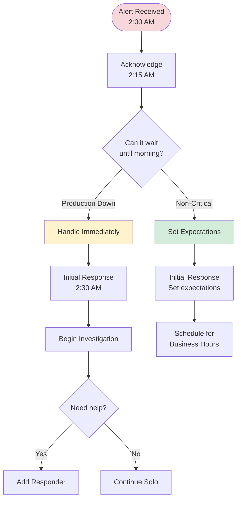

# PagerDuty Common Scenarios - Cheat Sheet

## 🌙 Scenario 1: Sev 1 Incident During Off-Hours

### Situation
```
⏰ Time: 2:00 AM
🚨 Alert: Sev 1 - Customer cannot deploy VPC
📱 You're woken up by PagerDuty alert
```

### Decision Tree


### Action Plan

#### If Truly Urgent (Production Impact)
```
✅ 2:00 AM - Acknowledge immediately
✅ 2:15 AM - Review case details
✅ 2:30 AM - Post initial response:

@support We have received this Sev 1 case and are investigating.
Initial assessment in progress.
Next update within 1 hour.

✅ 2:30-3:30 AM - Investigate
✅ 3:30 AM - Provide status update
✅ Consider adding responder if complex
```

#### If Can Wait Until Business Hours
```
✅ 2:00 AM - Acknowledge immediately
✅ 2:15 AM - Review case details
✅ 2:30 AM - Post initial response:

@support We have received this case and reviewed the details.
Based on our initial assessment, this issue [BRIEF EXPLANATION].
We will begin detailed investigation at [TIME] and provide a comprehensive update by [TIME].

If this is causing immediate production impact, please let us know and we will escalate accordingly.

✅ Set alarm for business hours
✅ Continue investigation during business hours
```

---

## 🔥 Scenario 2: Multiple Sev 1 Incidents Simultaneously

### Situation
```
🚨 Incident 1: CS4128655 - VPC deployment failure
🚨 Incident 2: CS4128670 - OpenShift cluster timeout
🚨 Incident 3: CS4128685 - Secrets Manager error
⏰ All within 30 minutes
```

### Priority Matrix
```
┌─────────────────────────────────────────────────────┐
│ Priority 1: Production Down + Premium Support      │
│ Priority 2: Production Down + Advanced Support     │
│ Priority 3: Major Impact + Premium Support         │
│ Priority 4: Major Impact + Advanced Support        │
└─────────────────────────────────────────────────────┘
```

### Action Plan

#### Step 1: Acknowledge All (0-15 min)
```
✅ Acknowledge all three incidents in PagerDuty
✅ Quick scan of each case
✅ Identify highest priority
```

#### Step 2: Triage (15-30 min)
```
For each incident, note:
- Customer support plan
- Production impact (yes/no)
- Error type
- Complexity

Example:
CS4128655: Premium, Prod Down, VPC timeout, Medium → Priority 1
CS4128670: Advanced, Prod Down, OCP timeout, High → Priority 2  
CS4128685: Premium, Non-Prod, SM error, Low → Priority 3
```

#### Step 3: Initial Responses (30-45 min)
```
Post initial response to ALL incidents:

@support We have received this case and are investigating.
We are currently handling multiple high-severity incidents and have prioritized based on impact.
Initial assessment in progress.
Next update within 1 hour.
```

#### Step 4: Add Responders (Immediately)
```
✅ Add responder for Priority 2 incident
✅ Add responder for Priority 3 incident
✅ Notify team lead in Slack:

"Multiple Sev 1 incidents active:
- CS4128655: VPC timeout (handling)
- CS4128670: OCP timeout (added @engineer1)
- CS4128685: SM error (added @engineer2)

All acknowledged and initial responses sent."
```

#### Step 5: Focus on Priority 1
```
✅ Deep dive into highest priority
✅ Monitor progress on others via Slack
✅ Coordinate with responders
✅ Provide updates on all incidents per SLA
```

---

## 🔄 Scenario 3: Incident During Shift Handoff

### Situation
```
⏰ Time: 4:45 PM (Your shift ends at 5:00 PM)
🚨 New Sev 2 alert received
📊 Investigation will take 2+ hours
👤 Next on-call starts at 5:00 PM
```

### Handoff Checklist

#### Before Handoff (4:45-5:00 PM)
```
✅ Acknowledge incident
✅ Post initial response
✅ Begin investigation
✅ Document findings in GitHub:

Internal note:
Initial investigation started at 4:45 PM.

Findings so far:
- Error appears to be [DESCRIPTION]
- Checked [WHAT YOU CHECKED]
- Next steps: [WHAT TO DO NEXT]

SLA deadline: [TIME]
Handoff to: [NEXT ON-CALL]
```

#### During Handoff (5:00 PM)
```
✅ Add incoming on-call as responder in PagerDuty
✅ Brief via Slack:

"Handing off CS[NUMBER] to you:
- Sev 2, Premium support
- Issue: [BRIEF]
- What I've done: [SUMMARY]
- What's next: [NEXT STEPS]
- SLA deadline: [TIME]
- GitHub: [LINK]

Let me know if you have questions!"

✅ Quick call if complex (5-10 min)
✅ Remain available for questions
```

#### After Handoff (5:00+ PM)
```
✅ Monitor Slack for questions (next 30 min)
✅ Respond if pinged
✅ Transfer ownership in PagerDuty once confirmed
```

---

## 📞 Scenario 4: Customer Escalation

### Situation
```
🚨 Sev 1 case - 4 hours old
😠 Customer escalated to management
📧 Support team added escalation note
⏰ SLA was met but customer unhappy with progress
```

### Response Strategy

#### Immediate Actions (0-15 min)
```
✅ Acknowledge escalation in GitHub:

@support We acknowledge the customer escalation and understand the urgency.

Current status:
- We have been investigating for [TIME]
- We have identified [FINDINGS]
- We are currently [CURRENT ACTION]
- Expected resolution: [TIMEFRAME]

We are increasing our update frequency to every 30 minutes and have added senior resources to expedite resolution.

✅ Notify your manager via Slack
✅ Add senior team member as responder
```

#### Increase Communication (Ongoing)
```
✅ Update every 30 minutes (instead of hourly)
✅ Be more detailed in updates
✅ Show progress and actions taken
✅ Set clear expectations

Example update:
@support Update (30 min):

Progress:
- Completed analysis of [COMPONENT]
- Identified root cause: [CAUSE]
- Currently implementing [SOLUTION]
- Testing in progress

Next steps:
- Complete testing (15 min)
- Provide solution to customer (30 min)

Next update in 30 minutes or sooner if resolved.
```

#### Resolution
```
✅ Provide detailed solution
✅ Verify customer satisfaction via support team
✅ Document lessons learned
✅ Follow up with manager
```

---

## 🔧 Scenario 5: Service Team Not Responding

### Situation
```
🚨 Sev 1 - Secrets Manager timeout
⏰ Escalated to ACS Security 2 hours ago
📭 No response from service team
⏱️ SLA deadline in 30 minutes
```

### Escalation Path

#### Step 1: Re-engage Service Team (Immediately)
```
In #acs-security Slack:
"Urgent: Following up on CS[NUMBER]

We escalated this Sev 1 Secrets Manager issue 2 hours ago but haven't received a response.

Customer is experiencing production impact.
SLA deadline in 30 minutes.

Can someone from your team please respond?

GitHub: [LINK]
PagerDuty: [LINK]"
```

#### Step 2: Notify Support Team
```
@support Update:

We have escalated this issue to the Secrets Manager team as the error is service-specific.
We are actively following up with them for a response.

We will continue to coordinate and provide updates every 30 minutes.
```

#### Step 3: Escalate to Management (If No Response)
```
Slack to your manager:
"Need help with CS[NUMBER]

- Sev 1, Secrets Manager issue
- Escalated to ACS Security 2 hours ago
- No response yet
- SLA deadline in 30 minutes
- Customer production impacted

Can you help engage the service team?"
```

#### Step 4: Parallel Investigation
```
While waiting:
✅ Continue investigating what you can
✅ Check for workarounds
✅ Review similar past issues
✅ Document everything
✅ Keep customer updated
```

---

## 🌐 Scenario 6: Wrong Team Assignment

### Situation
```
🚨 Alert received for CS4128655
📋 Configuration Item: deploy-arch-ibm-slz-vpc
🔍 Error: "Key Protect key rotation failed"
❌ This is NOT an SLZ issue - it's Key Protect
```

### Quick Reassignment Process

#### Step 1: Acknowledge & Assess (0-15 min)
```
✅ Acknowledge in PagerDuty
✅ Review error logs
✅ Confirm it's not SLZ issue
✅ Identify correct team (ACS Security)
```

#### Step 2: Contact Support Team (15-20 min)
```
In #cloud-support:
"Case CS4128655 was assigned to SLZ team but this is a Key Protect issue.

Error: Key rotation failed with error [ERROR]
This is a Key Protect service issue, not related to our DA automation.

Configuration Item should be: kms
Assignment Group should be: acs-security

Can @acs-security confirm they can take this case?"
```

#### Step 3: Wait for Confirmation (20-25 min)
```
✅ Wait for ACS Security to confirm
✅ Meanwhile, post initial response:

@support We have received this case and reviewed the error.
This appears to be a Key Protect service issue rather than a Deployable Architecture issue.
We are coordinating with the Key Protect team for proper assignment.
```

#### Step 4: Update ServiceNow (25-30 min)
```
✅ Change Configuration Item to "kms"
✅ Assignment Group updates automatically to "acs-security"
✅ Add internal note:
   "Reassigned to ACS Security - Key Protect service issue"
```

#### Step 5: Resolve PagerDuty (30 min)
```
✅ Add resolution note: "Case reassigned to ACS Security team"
✅ Click Resolve
✅ Update GitHub if issue exists
```

---

## 🔍 Scenario 7: Missing Information from Customer

### Situation
```
🚨 Sev 2 case received
📋 Description: "Deployment failed"
❌ No logs provided
❌ No error messages
❌ No screenshots
⏰ Need info to investigate
```

### Information Request Strategy

#### Step 1: Initial Response (0-30 min)
```
@support We have received this case and are ready to investigate.

To proceed with our investigation, we need the following information:
1. Complete Schematics workspace logs
2. Screenshots of any error messages in the IBM Cloud UI
3. The input variables used for the deployment (with sensitive data redacted)
4. The IBM Cloud account ID
5. The region where deployment was attempted
6. The exact timestamp when the failure occurred

Could you please ask the customer to provide this information?

In the meantime, we will review what information is available.
```

#### Step 2: Parallel Investigation (30 min - 2 hours)
```
While waiting for information:
✅ Check if any logs are attached to case
✅ Review case description for clues
✅ Check for similar recent issues
✅ Prepare troubleshooting approach
✅ Set reminder for follow-up
```

#### Step 3: Follow-up (Every 2-4 hours)
```
@support Following up on our request for information.

We need the following to continue our investigation:
- [LIST STILL-MISSING ITEMS]

Without this information, we cannot proceed with troubleshooting.
Please let us know if the customer needs guidance on how to collect these details.
```

#### Step 4: Provide Guidance (If Needed)
```
@support To help the customer collect the required information:

**For Schematics logs:**
1. Go to IBM Cloud Console
2. Navigate to Schematics > Workspaces
3. Select the workspace
4. Click on "Jobs" tab
5. Click on the failed job
6. Copy the complete log output

**For error screenshots:**
1. Take screenshot of any error messages
2. Include the full error text if possible

We're ready to investigate as soon as we receive this information.
```

---

## ⚡ Scenario 8: Quick Win - Known Issue

### Situation
```
🚨 Sev 2 alert received
🔍 Error: "Timeout waiting for VPC subnet"
✅ You recognize this - it's a known issue
📚 Solution documented in troubleshooting guide
```

### Fast Resolution Process

#### Step 1: Acknowledge & Verify (0-10 min)
```
✅ Acknowledge incident
✅ Review logs to confirm it matches known issue
✅ Check troubleshooting guide for solution
✅ Verify solution is still valid
```

#### Step 2: Provide Solution (10-20 min)
```
@support We have identified the issue and the solution.

**Problem**: VPC subnet creation timeout

**Root Cause**: This occurs when the VPC service is experiencing high load in the region. The subnet is actually created successfully, but the API response times out before confirmation is received.

**Solution**:
1. Wait 5-10 minutes for the subnet creation to complete
2. Refresh the Schematics workspace
3. Click "Generate Plan" to verify the subnet exists
4. If the subnet is shown in the plan as already existing, click "Apply Plan" to continue the deployment

**Expected Outcome**: The deployment will recognize the existing subnet and continue successfully.

This is a known intermittent issue with VPC service response times. The customer can retry the deployment after following these steps.
```

#### Step 3: Wait for Confirmation (20 min - 2 hours)
```
✅ Monitor for customer feedback
✅ Be ready to provide additional help if needed
✅ Resolve PagerDuty once case is closed
```

---

## 🎯 Scenario Decision Matrix

| Scenario | Immediate Action | Add Responder? | Escalate? | Timeline |
|----------|-----------------|----------------|-----------|----------|
| **Off-hours Sev 1** | Assess urgency | If complex | If production | 15 min |
| **Multiple Sev 1s** | Acknowledge all | Yes, immediately | Notify lead | 15 min |
| **Shift handoff** | Document status | Add next on-call | No | 15 min |
| **Customer escalation** | Acknowledge | Add senior | Notify manager | Immediate |
| **Service no response** | Re-engage | Maybe | If SLA risk | 30 min |
| **Wrong team** | Confirm error | No | Reassign | 20 min |
| **Missing info** | Request info | No | No | 30 min |
| **Known issue** | Provide solution | No | No | 20 min |

---

## 📋 Scenario Response Templates

### Template 1: Off-Hours Non-Urgent
```markdown
@support We have received this case and reviewed the details.

Based on our initial assessment, this issue [BRIEF EXPLANATION OF WHY IT CAN WAIT].

We will begin detailed investigation at [TIME] and provide a comprehensive update by [TIME].

If this is causing immediate production impact, please let us know and we will escalate accordingly.
```

### Template 2: Multiple Incidents
```markdown
@support We have received this case and are investigating.

We are currently handling multiple high-severity incidents and have prioritized based on impact and support plan.

Initial assessment in progress.
Next update within 1 hour.
```

### Template 3: Handoff
```markdown
Internal note:
Handing off to [NAME] at [TIME].

Status:
- Investigation started: [TIME]
- Findings: [SUMMARY]
- Next steps: [ACTIONS]
- SLA deadline: [TIME]

[NAME] added as responder.
```

### Template 4: Service Team Escalation
```markdown
@support This issue is related to [SERVICE] and requires their involvement.

We have escalated to the [SERVICE] team and are coordinating with them for resolution.

Current status: [STATUS]
Next update within [TIME].
```

---

**Pro Tip**: Save these scenarios and templates for quick reference during your on-call shift!

**Last Updated**: 2026-02-19