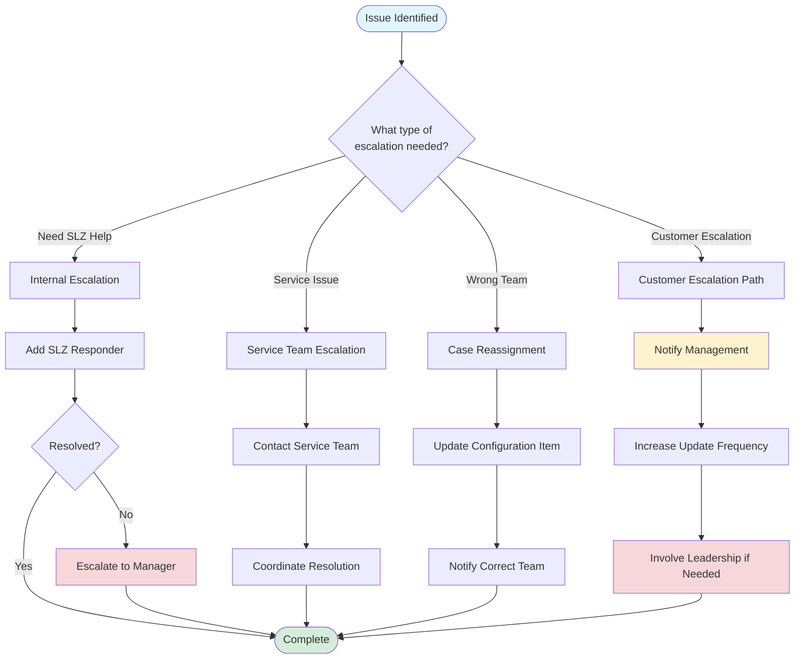

# PagerDuty Escalation Paths - Cheat Sheet

## 🎯 Escalation Decision Tree



---

## 🔄 Internal Escalation (SLZ Team)

### When to Add SLZ Responder

| Situation | Action | Timeline |
|-----------|--------|----------|
| Complex technical issue | Add responder with specific expertise | Immediately |
| Approaching SLA deadline | Add responder for assistance | 30 min before deadline |
| Multiple Sev 1 incidents | Add responder to distribute load | Immediately |
| End of shift handoff | Add incoming on-call | During handoff |
| Need second opinion | Add senior team member | When uncertain |
| Blocked on investigation | Add responder with fresh perspective | After 1-2 hours |

### How to Add Responder

#### Via PagerDuty Website
```
1. Open incident in PagerDuty
2. Click "Add Responders" button
3. Select team member or escalation policy
4. Add context message:
   "Need assistance with [ISSUE]. 
    Case: CS[NUMBER]
    GitHub: [LINK]
    Current status: [SUMMARY]"
5. Click "Add Responders"
```

#### Via PagerDuty Mobile App
```
1. Open incident
2. Tap "Add Responders"
3. Select person
4. Add message with context
5. Tap "Send"
```

### Communication Template

**In GitHub Issue** (without @support):
```markdown
Internal note:
Added [NAME] as responder to this incident.

Context:
- Current investigation status: [SUMMARY]
- What we've tried: [LIST]
- What we need help with: [SPECIFIC HELP]
- SLA deadline: [TIME]
```

**In Slack (#cpre-team)**:
```
@[NAME] - Added you as responder to PagerDuty incident for Case CS[NUMBER]

Quick context:
- Issue: [BRIEF DESCRIPTION]
- GitHub: [LINK]
- Need help with: [SPECIFIC AREA]
- SLA: [TIME REMAINING]
```

---

## 🔧 Service Team Escalation

### Service Team Contact Matrix

| Service | Team | Slack Channel | GitHub Org | PagerDuty Service |
|---------|------|---------------|------------|-------------------|
| **Secrets Manager** | ACS Security | #acs-security | terraform-ibm-modules | ACS Security PD |
| **VPC** | ACS Network | #acs-network | terraform-ibm-modules | ACS Network PD |
| **COS** | ACS PAAS Core | #acs-paas-core | terraform-ibm-modules | ACS PAAS PD |
| **Key Protect** | ACS Security | #acs-security | terraform-ibm-modules | ACS Security PD |
| **IKS/OpenShift** | Container Service | #armada-users | N/A | Container Service PD |
| **Schematics** | Schematics Team | #schematics-users | N/A | Schematics PD |

### When to Escalate to Service Team

| Indicator | Action |
|-----------|--------|
| Service API returning 5xx errors | Escalate immediately |
| Service experiencing CIE | Check status page, escalate if needed |
| Timeout errors from service | Escalate after confirming pattern |
| Service-specific configuration issue | Escalate with details |
| Feature not working as documented | Escalate with reproduction steps |

### Escalation Process

#### Step 1: Document in GitHub Issue
```markdown
Internal note (not for customer):
This issue requires escalation to [SERVICE] team.

Error details:
- Service: [SERVICE NAME]
- Error: [SPECIFIC ERROR MESSAGE]
- Status Code: [IF APPLICABLE]
- Frequency: [HOW OFTEN OCCURRING]
- Impact: [SCOPE OF IMPACT]

Service team contact: [SLACK CHANNEL]
```

#### Step 2: Contact Support Team
```markdown
@support This issue is related to [SERVICE] and requires their involvement.

Error details:
- Service: [SERVICE NAME]
- Error: [ERROR MESSAGE]
- Status Code: [IF APPLICABLE]

Could you please:
1. Open a GitHub issue to the [SERVICE] team, OR
2. Update the Configuration Item to [SERVICE CONFIG ITEM]

We will coordinate with the [SERVICE] team to resolve this issue.
```

#### Step 3: Contact Service Team (if Sev 1)

**Via Slack**:
```
Hi [SERVICE] team,

We have a Sev 1 customer case (CS[NUMBER]) experiencing issues with [SERVICE].

Error: [BRIEF ERROR]
Impact: [CUSTOMER IMPACT]
GitHub Issue: [LINK]

Can someone from your team take a look?

Thanks!
```

#### Step 4: Coordinate and Update

Provide regular updates:
```markdown
@support Update: We are working with [SERVICE] team on this issue.

Current status:
- [SERVICE] team is investigating
- They have identified [FINDINGS]
- Expected resolution: [TIMEFRAME]

Next update in [TIME].
```

---

## 🔀 Case Reassignment

### Reassignment Decision Matrix

| Configuration Item | Correct Team | Assignment Group |
|-------------------|--------------|------------------|
| `secrets-manager` | ACS Security | acs-security |
| `is` (VPC) | ACS Network | acs-network |
| `cloud-object-storage` | ACS PAAS Core | acs-paas-core |
| `kms` (Key Protect) | ACS Security | acs-security |
| `containers-kubernetes` | Container Service | containers-kubernetes |
| `schematics` | Schematics Team | schematics |

### Reassignment Process

#### Step 1: Identify Correct Team
```
1. Read error message in logs
2. Identify failing IBM Cloud service
3. Check Service Dependencies guide
4. Determine correct Configuration Item
```

#### Step 2: Contact Support Team via Slack

**In #cloud-support**:
```
Case CS[NUMBER] was assigned to SLZ team but appears to be a [SERVICE] issue.

Error: [BRIEF ERROR DESCRIPTION]
Configuration Item should be: [CORRECT CI]

Can @[TEAM] confirm this could be assigned to them?
```

#### Step 3: Wait for Confirmation
```
- Wait for team to confirm they'll take the case
- Do not update ServiceNow until confirmed
- Continue investigation if possible
```

#### Step 4: Update ServiceNow
```
1. Open case in ServiceNow
2. Change Configuration Item to correct value
3. Assignment Group will update automatically
   (or update manually if needed)
4. Add internal note:
   "Case reassigned to [TEAM].
    Error indicates: [BRIEF EXPLANATION]"
```

#### Step 5: Update GitHub Issue
```markdown
@support This case has been reassigned to [TEAM] as the issue is with [SERVICE].

The error indicates [BRIEF EXPLANATION].

Case Configuration Item updated to [NEW CONFIG ITEM].
```

#### Step 6: Resolve PagerDuty
```
1. Add note: "Case reassigned to [TEAM]"
2. Click "Resolve"
```

---

## 👥 Customer Escalation Path

### Escalation Levels

```
Level 1: On-Call Engineer
    ↓
Level 2: SLZ Team Lead
    ↓
Level 3: SLZ Manager
    ↓
Level 4: Director/VP
```

### When Customer Escalates

#### Indicators
- Support team adds "Customer Escalation" note in ServiceNow
- Notification in GitHub issue
- Direct contact from management
- Multiple complaints about response time

#### Immediate Actions

1. **Acknowledge Escalation**
```markdown
@support We acknowledge the customer escalation and are prioritizing this case.

Current status:
- [WHAT WE'VE DONE]
- [WHAT WE'RE DOING NOW]
- [EXPECTED TIMELINE]

We will provide updates every [FREQUENCY].
```

2. **Notify Management**
```
Via Slack to manager:
"Customer escalation on Case CS[NUMBER]
- Severity: [SEV]
- Issue: [BRIEF]
- Current status: [STATUS]
- GitHub: [LINK]

I'm handling it but wanted you to be aware."
```

3. **Increase Update Frequency**
```
- Sev 1: Every 30 minutes
- Sev 2: Every 1 hour
- Provide detailed status in each update
```

4. **Add Responder if Needed**
```
- Add senior team member
- Add team lead if appropriate
- Ensure continuous coverage
```

### Escalation Communication Template

**To Customer (via @support)**:
```markdown
@support We understand the urgency of this issue and have escalated internally.

Current actions:
1. [ACTION 1]
2. [ACTION 2]
3. [ACTION 3]

We have [TEAM LEAD/SENIOR ENGINEER] now involved and will provide updates every [FREQUENCY].

Next update: [SPECIFIC TIME]
```

---

## 📊 Escalation Tracking

### Track Escalations

| Case | Escalation Type | To Whom | Time | Reason | Status |
|------|----------------|---------|------|--------|--------|
| CS#### | Internal | [Name] | HH:MM | Complex issue | Active |
| CS#### | Service | ACS Security | HH:MM | SM timeout | Waiting |
| CS#### | Customer | Manager | HH:MM | SLA risk | Resolved |

---

## ⚠️ Escalation Best Practices

### DO ✅
- Escalate proactively before SLA deadline
- Provide complete context when escalating
- Document all escalations in GitHub
- Keep all parties informed of progress
- Follow up after escalation
- Thank responders for their help

### DON'T ❌
- Wait until last minute to escalate
- Escalate without providing context
- Escalate without attempting investigation
- Forget to update after escalation
- Escalate to wrong team/person
- Skip documentation

---

## 🆘 Emergency Escalation

### Sev 1 with Multiple Issues

**Immediate Actions**:
1. Acknowledge all incidents
2. Add responders to distribute load
3. Notify team lead immediately
4. Prioritize by customer impact
5. Provide status updates on all

**Communication**:
```
Slack to #cpre-team:
"Multiple Sev 1 incidents active:
- CS[NUM1]: [BRIEF]
- CS[NUM2]: [BRIEF]

Need help - adding responders now."
```

### SLA About to Miss

**30 Minutes Before Deadline**:
```
1. Add responder immediately
2. Notify manager
3. Provide proactive update to customer
4. Document what's blocking resolution
```

**Communication**:
```markdown
@support Status update:

We are actively working on this issue. Current situation:
- Investigation findings: [SUMMARY]
- Current action: [WHAT WE'RE DOING]
- Blocker: [IF ANY]

We have added additional resources and will provide resolution as soon as possible.
Next update in [TIME].
```

---

## 📞 Escalation Contact List

### SLZ Team
| Role | Contact | Method |
|------|---------|--------|
| Team Lead | [Name] | Slack DM / Phone |
| Manager | [Name] | Slack DM / Phone |
| Senior Engineer | [Name] | PagerDuty / Slack |

### Service Teams
| Team | Primary Contact | Slack Channel |
|------|----------------|---------------|
| ACS Security | [Name] | #acs-security |
| ACS Network | [Name] | #acs-network |
| ACS PAAS Core | [Name] | #acs-paas-core |
| Container Service | [Name] | #armada-users |

### Support Team
| Contact | Method |
|---------|--------|
| Support Lead | #cloud-support |
| Support Manager | Escalate via support lead |

---

## 🔔 Escalation Checklist

### Before Escalating
- [ ] Attempted initial investigation
- [ ] Gathered all available information
- [ ] Documented findings in GitHub
- [ ] Identified specific help needed
- [ ] Checked SLA deadline
- [ ] Prepared context for responder

### During Escalation
- [ ] Added responder in PagerDuty
- [ ] Posted context in GitHub (internal note)
- [ ] Notified via Slack with details
- [ ] Provided access to all relevant information
- [ ] Set expectations for handoff if needed

### After Escalation
- [ ] Monitored progress
- [ ] Provided updates to customer
- [ ] Documented resolution
- [ ] Thanked responder
- [ ] Updated incident status
- [ ] Closed escalation loop

---

**Remember**: Escalating is not a sign of weakness - it's a sign of good judgment and customer focus!

**Last Updated**: 2026-02-19