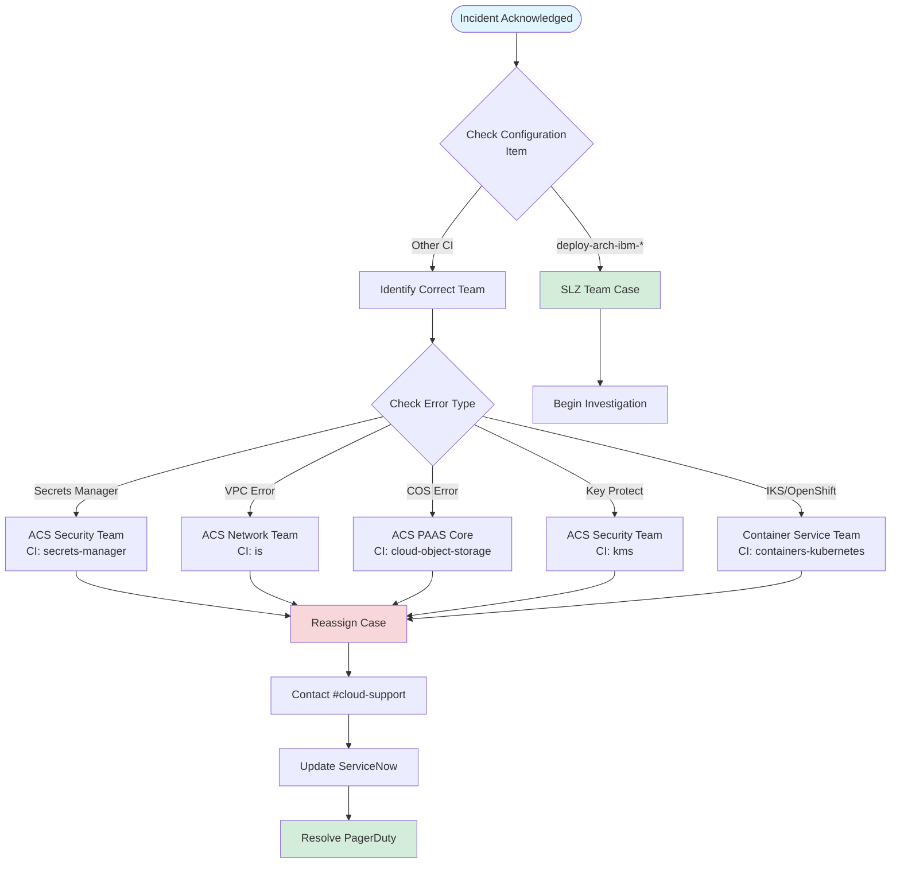
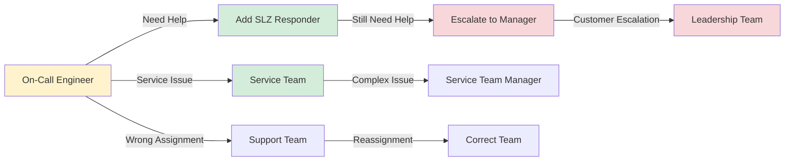
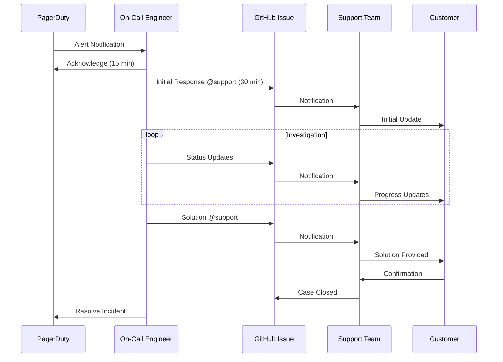

# PagerDuty Incident Handling - Workflow Diagram

## Main Incident Handling Flow

```mermaid
flowchart TD
    Start([PagerDuty Alert Received]) --> Acknowledge[Acknowledge Incident<br/>Within 15 minutes]
    Acknowledge --> Review[Review Incident Details<br/>- Case Number<br/>- Severity<br/>- Description]
    Review --> AccessSN[Access ServiceNow Case]
    AccessSN --> AccessGH[Access GitHub Issue]
    AccessGH --> CheckOwner{Does case belong<br/>to SLZ team?}
    
    CheckOwner -->|No| Redirect[Redirect Case<br/>Step 4]
    CheckOwner -->|Yes| InitialResponse[Provide Initial Response<br/>Within 30 minutes<br/>@support in GitHub]
    
    Redirect --> ContactTeam[Contact correct team<br/>via #cloud-support]
    ContactTeam --> UpdateSN[Update ServiceNow<br/>Configuration Item]
    UpdateSN --> ResolvePD1[Resolve PagerDuty<br/>Incident]
    
    InitialResponse --> CheckSLA[Check SLA Requirements<br/>Based on Severity + Plan]
    CheckSLA --> Investigation[Begin Investigation<br/>Step 6]
    
    Investigation --> CollectInfo[Collect Required Info<br/>- Logs<br/>- Error messages<br/>- Screenshots]
    CollectInfo --> ReviewLogs[Review Available Logs]
    ReviewLogs --> Decision{Can solve<br/>immediately?}
    
    Decision -->|Yes| ProvideSolution[Provide Solution<br/>Step 8]
    Decision -->|No| NeedInfo{Need more<br/>information?}
    
    NeedInfo -->|Yes| RequestInfo[Request Info from<br/>Customer via @support]
    RequestInfo --> WaitInfo[Wait for Response]
    WaitInfo --> StatusUpdate1[Provide Status Update<br/>Every 1-4 hours]
    StatusUpdate1 --> Investigation
    
    NeedInfo -->|No| ServiceIssue{Service-specific<br/>issue?}
    
    ServiceIssue -->|Yes| EscalateService[Escalate to Service Team<br/>Step 9]
    ServiceIssue -->|No| NeedHelp{Need help from<br/>SLZ team?}
    
    EscalateService --> ContactService[Contact Service Team<br/>via Slack/GitHub]
    ContactService --> CoordinateService[Coordinate with<br/>Service Team]
    CoordinateService --> StatusUpdate2[Provide Regular Updates<br/>to @support]
    StatusUpdate2 --> ServiceResolved{Issue<br/>resolved?}
    ServiceResolved -->|No| CoordinateService
    ServiceResolved -->|Yes| ProvideSolution
    
    NeedHelp -->|Yes| AddResponder[Add Responder<br/>Step 10]
    NeedHelp -->|No| ContinueInvestigation[Continue Investigation]
    
    AddResponder --> ProvideContext[Provide Context<br/>in GitHub + Slack]
    ProvideContext --> ContinueInvestigation
    ContinueInvestigation --> StatusUpdate3[Provide Status Update]
    StatusUpdate3 --> Decision
    
    ProvideSolution --> DocumentSolution[Document Solution<br/>in GitHub Issue<br/>@support]
    DocumentSolution --> WaitClosure[Wait for Case Closure<br/>by Support Team]
    WaitClosure --> CaseClosed{Case closed<br/>in ServiceNow?}
    
    CaseClosed -->|No| MonitorCase[Monitor Case Status]
    MonitorCase --> WaitClosure
    CaseClosed -->|Yes| ResolvePD2[Resolve PagerDuty<br/>Incident]
    
    ResolvePD1 --> End([End])
    ResolvePD2 --> CloseGH[Close GitHub Issue]
    CloseGH --> End
    
    style Start fill:#e1f5ff
    style End fill:#e1f5ff
    style Acknowledge fill:#fff3cd
    style InitialResponse fill:#fff3cd
    style ProvideSolution fill:#d4edda
    style ResolvePD1 fill:#d4edda
    style ResolvePD2 fill:#d4edda
    style Redirect fill:#f8d7da
    style EscalateService fill:#f8d7da
    style AddResponder fill:#f8d7da
```

## Decision Tree for Case Triage

```mermaid
flowchart TD
    Start([Incident Acknowledged]) --> CheckCI{Check Configuration<br/>Item}
    
    CheckCI -->|deploy-arch-ibm-*| SLZCase[SLZ Team Case]
    CheckCI -->|Other CI| IdentifyTeam[Identify Correct Team]
    
    IdentifyTeam --> CheckError{Check Error Type}
    
    CheckError -->|Secrets Manager| ACSecurity[ACS Security Team<br/>CI: secrets-manager]
    CheckError -->|VPC Error| ACSNetwork[ACS Network Team<br/>CI: is]
    CheckError -->|COS Error| ACSPaas[ACS PAAS Core<br/>CI: cloud-object-storage]
    CheckError -->|Key Protect| ACSecurity2[ACS Security Team<br/>CI: kms]
    CheckError -->|IKS/OpenShift| Container[Container Service Team<br/>CI: containers-kubernetes]
    
    ACSecurity --> Reassign[Reassign Case]
    ACSNetwork --> Reassign
    ACSPaas --> Reassign
    ACSecurity2 --> Reassign
    Container --> Reassign
    
    SLZCase --> Investigate[Begin Investigation]
    Reassign --> ContactSupport[Contact #cloud-support]
    ContactSupport --> UpdateCase[Update ServiceNow]
    UpdateCase --> Resolve[Resolve PagerDuty]
    
    style Start fill:#e1f5ff
    style SLZCase fill:#d4edda
    style Reassign fill:#f8d7da
    style Resolve fill:#d4edda
```

## SLA Timeline Flow

```mermaid
gantt
    title PagerDuty Incident Response Timeline
    dateFormat mm
    axisFormat %M min
    
    section Sev 1 Premium/Advanced
    Acknowledge Alert :crit, a1, 00, 15m
    Initial Response :crit, a2, after a1, 45m
    Status Update 1 :a3, after a2, 60m
    Status Update 2 :a4, after a3, 60m
    
    section Sev 2 Premium
    Acknowledge Alert :b1, 00, 15m
    Initial Response :b2, after b1, 105m
    Status Update 1 :b3, after b2, 120m
    
    section Sev 2 Advanced
    Acknowledge Alert :c1, 00, 15m
    Initial Response :c2, after c1, 225m
    Status Update 1 :c3, after c2, 240m
```

## Escalation Paths

```mermaid
flowchart LR
    OnCall[On-Call Engineer] -->|Need Help| Responder[Add SLZ Responder]
    OnCall -->|Service Issue| ServiceTeam[Service Team]
    OnCall -->|Wrong Assignment| SupportTeam[Support Team]
    
    Responder -->|Still Need Help| Manager[Escalate to Manager]
    ServiceTeam -->|Complex Issue| ServiceManager[Service Team Manager]
    SupportTeam -->|Reassignment| OtherTeam[Correct Team]
    
    Manager -->|Customer Escalation| Leadership[Leadership Team]
    
    style OnCall fill:#fff3cd
    style Responder fill:#d4edda
    style ServiceTeam fill:#d4edda
    style Manager fill:#f8d7da
    style Leadership fill:#f8d7da
```

## Communication Flow

```mermaid
sequenceDiagram
    participant PD as PagerDuty
    participant OC as On-Call Engineer
    participant GH as GitHub Issue
    participant ST as Support Team
    participant CU as Customer
    
    PD->>OC: Alert Notification
    OC->>PD: Acknowledge (15 min)
    OC->>GH: Initial Response @support (30 min)
    GH->>ST: Notification
    ST->>CU: Initial Update
    
    loop Investigation
        OC->>GH: Status Updates
        GH->>ST: Notification
        ST->>CU: Progress Updates
    end
    
    OC->>GH: Solution @support
    GH->>ST: Notification
    ST->>CU: Solution Provided
    CU->>ST: Confirmation
    ST->>GH: Case Closed
    OC->>PD: Resolve Incident
```
